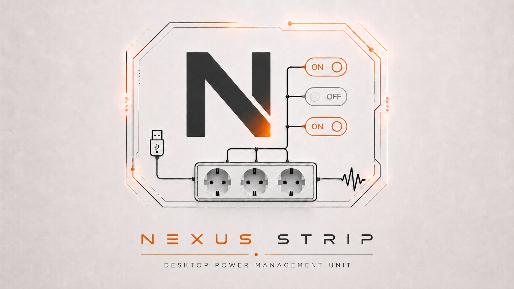
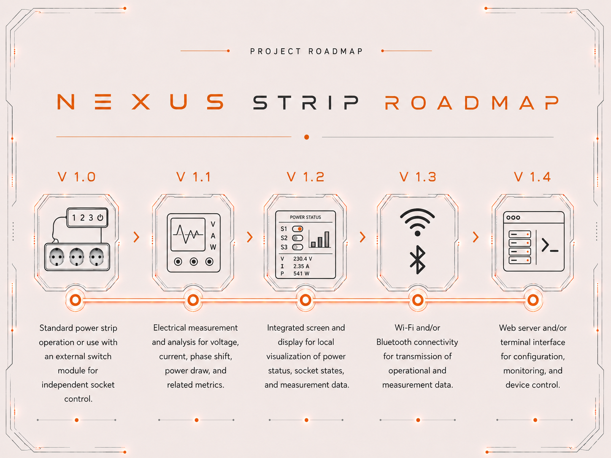

# NexusStrip

    
     
    
    
    
    
     
    
    
    
    
    

<h3 align="center">
  A modular desktop power management unit with manual switching and optional ESP32-S3 based MCU control.
</h3>

## Overview

Nexus Strip is a modular desktop power management unit designed to operate either as a conventional power strip or as an MCU-controlled switching system.

The project combines embedded firmware, relay control, PCB design and a modular control concept. The long-term goal is to support socket-level switching, power measurement, local display output, wireless communication and a local web or terminal-based user interface.

## Roadmap

    

## Project Status

Current version: **v0.0.9**

| Area | Status |
|---|---|
| Concept | In progress |
| Logo / visual identity | :white_check_mark: Done |
| Hardware architecture | In progress |
| Firmware architecture | Planned |
| KiCad PCB design | Planned / in progress |
| Relay control prototype | Planned |
| Display integration | Planned |
| Wireless communication | Planned |
| Power measurement | Planned |
| Webserver / TUI | Planned |

This repository documents the development process from concept to prototype. The current focus is system architecture, hardware partitioning and documentation.
