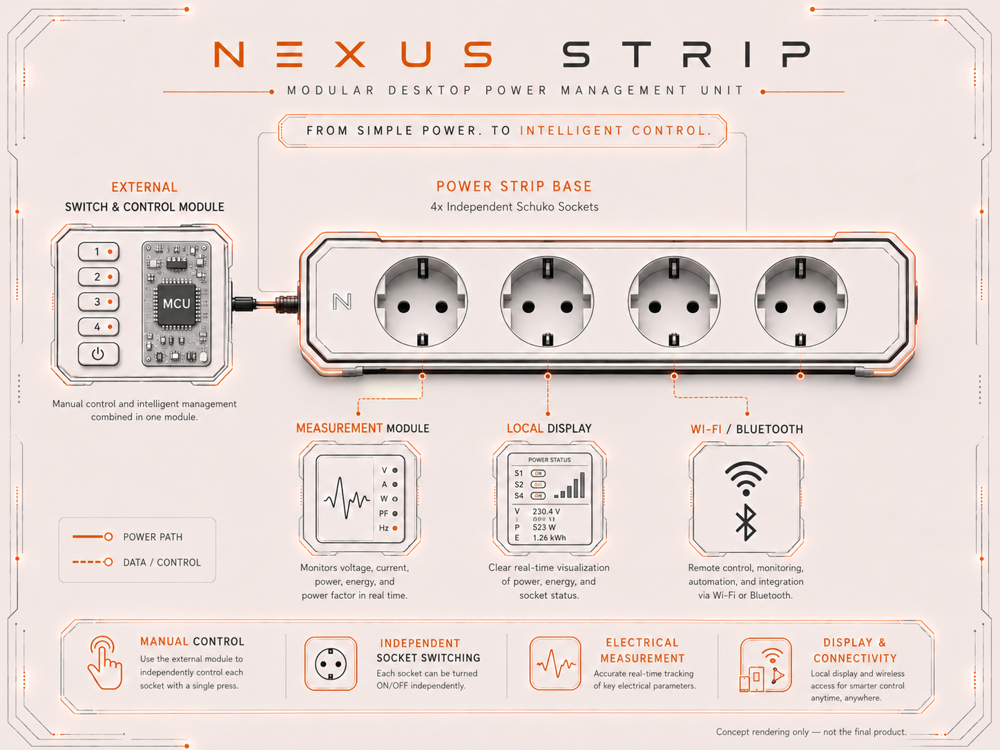
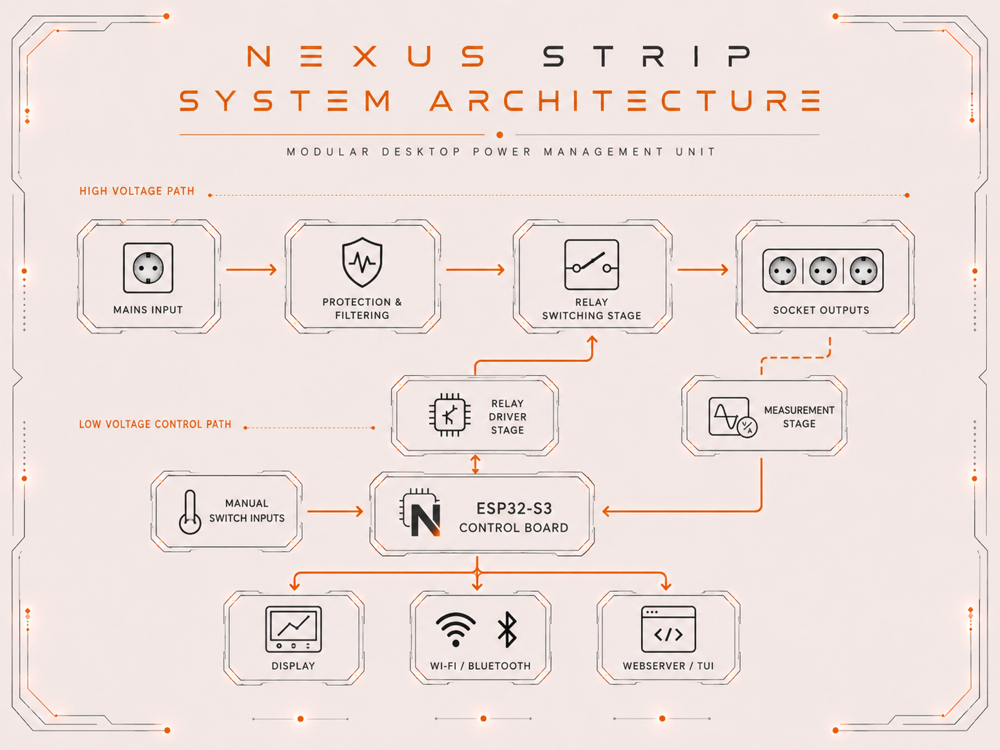

# NexusStrip

  
   
  
  
  
  
   
  
  
  
  
  

<h3 align="center">
  A modular desktop power management unit with manual switching and optional ESP32-S3 based MCU control.
</h3>

## Overview

Nexus Strip is a modular, cloud free, smart desktop power management unit designed to operate either as a conventional power strip or as an MCU-controlled switching system.

The project combines embedded firmware, relay control, PCB design and a modular control concept. The long-term goal is to support socket-level switching, power measurement, local display output, wireless communication and a local web or terminal-based user interface.

    

## What This Project Demonstrates

This project demonstrates practical engineering work across hardware, firmware and system design:

- ESP32-S3 based embedded system design
- ESP-IDF / FreeRTOS firmware architecture
- GPIO-based relay control
- Modular hardware concept with separate control electronics
- KiCad-based PCB design workflow
- Safety-conscious separation of low-voltage control logic and mains-voltage switching
- Roadmap-based product development
- Documentation of technical decisions, limitations and validation steps

## Roadmap

Nexus Strip is developed as an incremental embedded hardware platform. The first milestone focuses on a safe and reliable baseline: manual socket switching and modular MCU-assisted control. Later versions extend the system with measurement, visualization, wireless communication and local software interfaces.

The roadmap is structured so that every major feature builds on a validated lower-level layer. Switching and hardware partitioning come first, followed by electrical measurement, local display output, wireless communication and finally a webserver or terminal-based user interface.

    

| Version | Focus | Description | Status |
|---|---|---|---|
| **v0.0.9** | Concept and first documentation | Initial project structure, visual identity, roadmap,  high-level architecture planning. | ✅ Current |
| **v1.0** | Manual and modular switching | Baseline version that works as a standard power strip or with a separate switch box for individual socket control. | 🔄 Next milestone |
| **v1.1** | Electrical measurement | Adds voltage and current measurement to calculate values such as current draw, voltage, power and phase-related information. | ⬜ Planned |
| **v1.2** | Display integration | Adds an integrated screen for local power-management information, socket states and measurement data. | ⬜ Planned |
| **v1.3** | Wireless communication | Adds Wi-Fi and/or Bluetooth connectivity for transmitting operational and measurement data. | ⬜ Planned |
| **v1.4** | Local software interface | Adds a webserver and/or terminal interface for configuration, monitoring and device control. | ⬜ Planned |

## Project Status

Current version: **v0.0.9**

The project is currently in the concept and architecture phase. The roadmap, visual identity and repository documentation are established. The next technical milestone is **v1.0**, which focuses on the basic hardware and firmware foundation for manual switching and modular MCU-assisted socket control.

| Area | Status | Roadmap Reference |
|---|---|---|
| Roadmap | ✅ Done | v0.0.9 |
| Visual identity | ✅ Done | v0.0.9 |
| Repository documentation | 🔄 In progress | v0.0.9 |
| System architecture | 🔄 In progress | Required for v1.0 |
| Hardware architecture | 🔄 In progress | Required for v1.0 |
| KiCad PCB design | 🔄 In progress | Required for v1.0 |
| Manual switch concept | 🔄 In progress | v1.0 |
| Relay control prototype | 🔄 In progress | v1.0 |
| Firmware architecture | ⬜ Planned | v1.0 |
| Power measurement | ⬜ Planned | v1.1 |
| Display integration | ⬜ Planned | v1.2 |
| Wi-Fi / Bluetooth communication | ⬜ Planned | v1.3 |
| Webserver / TUI | ⬜ Planned | v1.4 |

This repository documents the development process from concept to prototype. The current focus is on system architecture, hardware partitioning, documentation and preparing the first functional switching prototype.

## System Architecture

    

